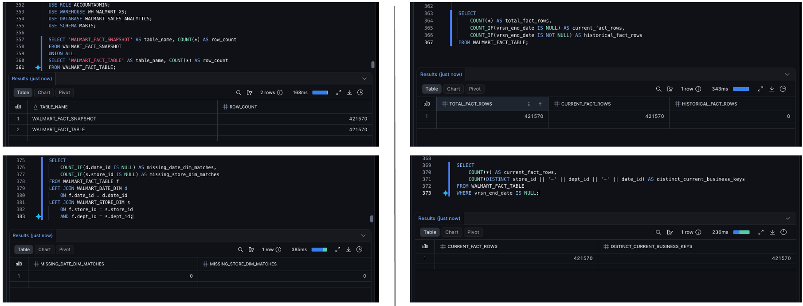

# Walmart Sales Analytics Engineering

End-to-end analytics engineering project that ingests Walmart sales source files, loads them into Snowflake, transforms them with dbt, validates the modeled data, and generates reporting outputs from the final mart tables.

## Project overview

This project models Walmart weekly sales data into a small analytics warehouse.

```text
Local source files
    ↓
Python batch ingestion to S3
    ↓
Snowflake raw tables
    ↓
dbt staging models
    ↓
dbt intermediate enriched model
    ↓
SCD1 dimensions + SCD2-style fact table
    ↓
Python reporting outputs
```

The final mart layer includes:

```text
WALMART_DATE_DIM
WALMART_STORE_DIM
WALMART_FACT_TABLE
```

## Business questions supported

The final reporting layer supports questions such as:

- How do total sales trend over time?
- Which store types contribute the most sales?
- How do holiday and non-holiday weeks compare?
- Which store and department combinations generate the highest sales?
- How do markdowns compare with sales by year?
- How does average weekly sales vary by temperature band?

## Tech stack

| Area | Tools |
|---|---|
| Cloud storage | Amazon S3 |
| Data warehouse | Snowflake |
| Transformation | dbt Core |
| Language | Python, SQL |
| Reporting outputs | pandas, matplotlib |
| Version control | Git, GitHub |

## Source data

The project uses three source CSV files:

| Source file | Description | Grain |
|---|---|---|
| `stores.csv` | Store attributes | One row per store |
| `department.csv` | Weekly department sales | One row per store, department, and date |
| `fact.csv` | Store/date context and markdown fields | One row per store and date |

Source files are stored locally under `data/raw/`, but CSVs are gitignored so raw data is not committed to the public repo.

## Repository structure

| Folder | Purpose |
|---|---|
| `analysis/` | Source profiling script and generated source-profile summary |
| `data/raw/` | Local raw data landing folder; CSVs are gitignored |
| `dbt/walmart_sales_analytics/` | dbt Core project for models, snapshots, tests, and macros |
| `docs/` | Architecture decisions, validation queries, reporting docs, and design references |
| `learning-notes/` | Public learning walkthroughs for each project phase |
| `manifests/` | Local ingestion manifest folder; generated JSON manifests are gitignored |
| `reports/` | Reporting output folder; generated files are gitignored |
| `screenshots/` | Build evidence screenshots |
| `scripts/` | Python workflow scripts |
| `sql/` | Standalone Snowflake and reporting SQL |

More detail is documented in:

```text
docs/repo-structure.md
```

## Data model

### Staging models

The staging layer cleans and types the raw Snowflake tables while preserving each source grain.

```text
RAW_WALMART_STORES              -> stg_walmart_stores
RAW_WALMART_DEPARTMENT_SALES    -> stg_walmart_department_sales
RAW_WALMART_STORE_FEATURES      -> stg_walmart_store_features
```

### Intermediate model

The intermediate model joins the cleaned staging models into one reusable enriched sales dataset.

```text
stg_walmart_department_sales
stg_walmart_store_features
stg_walmart_stores
    ↓
int_walmart_sales_enriched
```

The driving source is department sales because it contains the weekly sales measure and defines the sales grain.

### Mart models

The final mart layer contains two SCD Type 1 dimensions and one SCD2-style fact table.

```text
int_walmart_sales_enriched
    ↓
walmart_date_dim
walmart_store_dim
walmart_fact_snapshot
    ↓
walmart_fact_table
```

## Final tables

| Table | Type | Grain |
|---|---|---|
| `WALMART_DATE_DIM` | SCD Type 1 dimension | One row per sales date |
| `WALMART_STORE_DIM` | SCD Type 1 dimension | One row per store and department |
| `WALMART_FACT_TABLE` | SCD2-style fact table | One versioned row per store, department, and date |

The SCD2-style fact table is implemented with a dbt snapshot. The logical business key is:

```text
store_id + dept_id + date_id
```

The final fact table uses:

```text
vrsn_start_date
vrsn_end_date
```

to represent version validity.

## Validation summary

Key validation results:

| Layer | Validation | Result |
|---|---|---|
| Raw load | Raw row counts matched source profiling | Passed |
| Staging | Staging row counts matched raw/source counts | Passed |
| Intermediate | Sales row count preserved after joins | 421,570 before and after |
| Intermediate | Missing joined store/context fields | 0 |
| Date dimension | Expected row count | 143 |
| Store dimension | Expected row count | 3,331 |
| Fact table | Expected first-run row count | 421,570 |
| Fact table | Current fact rows | 421,570 |
| Fact table | Historical fact rows on first official run | 0 |
| Fact table | Missing dimension matches | 0 |

All validation SQL is collected in:

```text
docs/validation-queries.md
```

## dbt tests

The dbt project includes targeted tests for:

- not-null key fields
- unique grain checks
- accepted values for store type
- relationships between fact and dimension tables
- custom composite-key uniqueness checks

A custom generic test checks composite keys such as:

```text
store_id + dept_id + store_date
store_id + dept_id + date_id + vrsn_start_date
```

## Optional SCD2 demo

Because the official project uses one source batch, the official fact table has no historical rows on the first run.

An optional demo snapshot proves the SCD2 behavior by simulating one changed tracked value for an existing business key.

Demo documentation:

```text
docs/scd2-demo-proof.md
```

## Reporting outputs

The Python reporting script queries the final mart tables and generates CSV and PNG outputs.

Script:

```text
scripts/generate_walmart_reports.py
```

Reporting SQL:

```text
sql/09_reporting_queries.sql
```

Output folder:

```text
reports/generated/
```

Generated outputs include:

- monthly sales trend
- sales by store type
- holiday versus non-holiday sales
- top 10 store/department combinations
- sales and markdowns by year
- sales by temperature band

Reporting documentation:

```text
docs/reporting-outputs.md
```

## Evidence screenshots

Selected build evidence is stored under:

```text
screenshots/full-walkthrough/
```

Examples:





## How to run

### 1. Create and activate a virtual environment

```bash
python -m venv .venv
source .venv/bin/activate
python -m pip install -r requirements.txt
```

### 2. Configure Snowflake environment variables

Required:

```bash
export SNOWFLAKE_ACCOUNT='<your_snowflake_account>'
export SNOWFLAKE_USER='<your_snowflake_user>'
read -s "SNOWFLAKE_PASSWORD?Snowflake password: "
echo
export SNOWFLAKE_PASSWORD
```

Optional:

```bash
export SNOWFLAKE_ROLE='ACCOUNTADMIN'
export SNOWFLAKE_WAREHOUSE='WH_WALMART_XS'
export SNOWFLAKE_DATABASE='WALMART_SALES_ANALYTICS'
export SNOWFLAKE_SCHEMA='MARTS'
```

### 3. Run source profiling

```bash
python analysis/profile_source_data.py
```

### 4. Run S3 ingestion

```bash
python scripts/ingest_local_batch_to_s3.py \
  --bucket walmart-sales-landing-jenny \
  --prefix landing/walmart/batch_01 \
  --source-dir data/raw \
  --aws-profile retail-poc
```

### 5. Run Snowflake raw load SQL

Use:

```text
sql/04_snowflake_raw_ingestion.sql
```

This creates Snowflake database objects, an external stage, raw tables, and `COPY INTO` loads.

### 6. Run dbt

From the dbt project folder:

```bash
cd dbt/walmart_sales_analytics

dbt debug
dbt build --select path:models/staging
dbt build --select int_walmart_sales_enriched
dbt build --select walmart_date_dim walmart_store_dim
dbt snapshot --select walmart_fact_snapshot
dbt build --select walmart_fact_table
```

Optional SCD2 demo:

```bash
dbt snapshot --select demo_walmart_fact_snapshot
dbt snapshot --select demo_walmart_fact_snapshot --vars '{"demo_adjust_weekly_sales": true}'
```

### 7. Generate dbt docs

```bash
dbt docs generate
dbt docs serve
```

### 8. Generate reporting outputs

From the repo root:

```bash
python scripts/generate_walmart_reports.py
```

## Project documentation

| Document | Purpose |
|---|---|
| `docs/source-to-target-mapping.md` | Source-to-target mapping and field design |
| `docs/data-model-design.md` | Dimensional modeling design |
| `docs/architecture-decisions.md` | Architecture decision record |
| `docs/validation-queries.md` | SQL validation checks |
| `docs/repo-structure.md` | Repository organization |
| `docs/scd2-demo-proof.md` | Optional SCD2 demo explanation |
| `docs/reporting-outputs.md` | Reporting output explanation |
| `docs/final-project-summary.md` | Short final project summary |

## Final project summary

This project demonstrates an end-to-end analytics engineering workflow: source profiling, cloud ingestion, warehouse loading, dbt modeling, data quality testing, SCD handling, validation, and reporting output generation.

The main engineering focus was not only building tables, but also validating that each layer preserved the expected grain and relationships.
