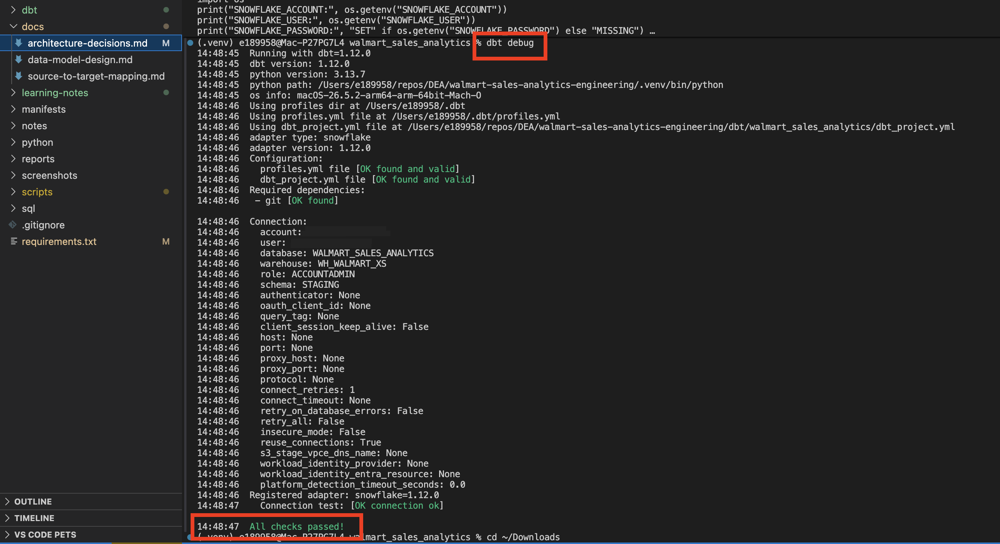
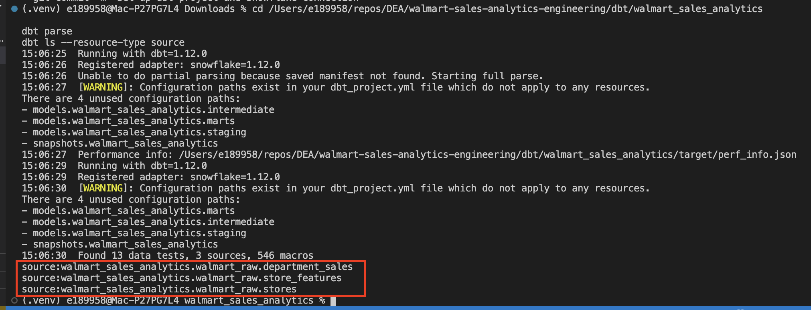
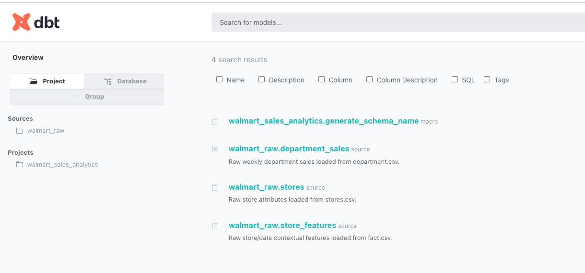
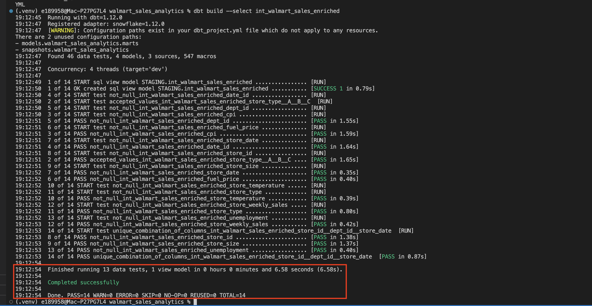
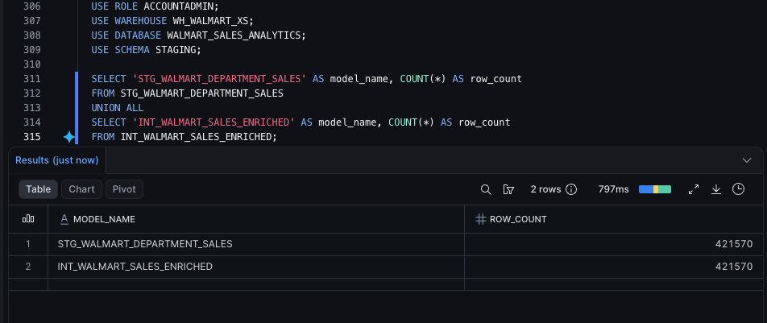
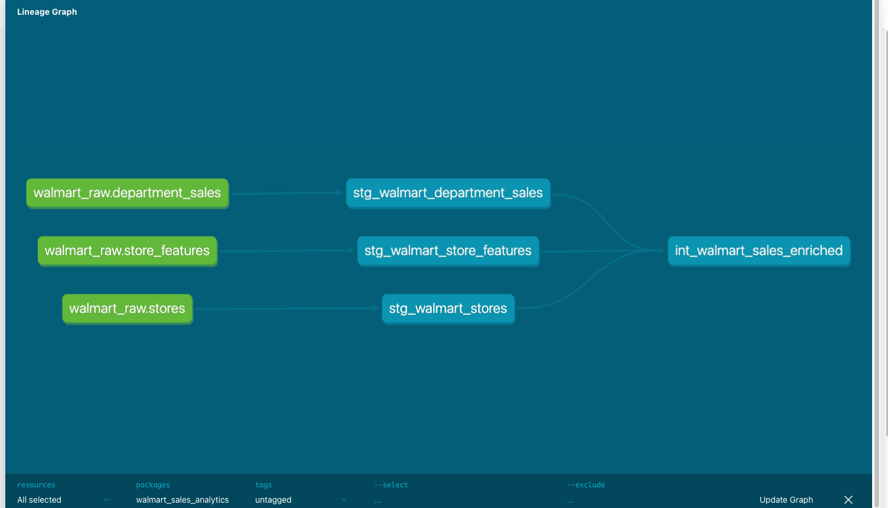

# Architecture Decisions

## ADR 001: Source profiling before cloud ingestion

### Decision

Profile and analyze the supplied CSV files locally before loading them to S3 and Snowflake.

### Rationale

The source files had different grains and responsibilities. Profiling confirmed row counts, candidate keys, null patterns, date ranges, and join relationships before dbt models were built.

This reduced the risk of designing transformations from assumptions.

### Outcome

The project identified `department.csv` as the driving weekly-sales source, `fact.csv` as store/date context, and `stores.csv` as store attributes.

## ADR 002: Python batch-ingestion utility for local source delivery

### Decision

Use an operator-triggered Python utility to upload the controlled local CSV batch to S3.

### Alternatives considered

| Option | Notes |
|---|---|
| AWS console upload | Simple, but not reproducible or auditable |
| Individual AWS CLI upload commands | Reproducible, but does not validate the batch as a unit |
| Python batch utility | Validates files, records metadata, uploads, verifies, and writes a manifest |
| Lambda/event-driven ingestion | Better for recurring AWS-accessible arrivals, but unnecessary for a one-time local batch |

### Rationale

The source data was supplied locally as one controlled batch. A Python utility provided repeatability, validation, and audit metadata without introducing unnecessary event-driven infrastructure.

### Outcome

The utility uploaded the source files to the S3 landing prefix and created a JSON manifest for the ingestion run.

## ADR 003: Snowflake raw layer with source-preserving VARCHAR columns

### Decision

Load the S3-landed CSV files into Snowflake raw tables with mostly `VARCHAR` columns.

### Rationale

The source files are CSVs, which are text-based and do not enforce a strong schema. The raw Snowflake layer is intended to preserve the source delivery with minimal assumptions.

Intentional casting to dates, numbers, booleans, and decimals will happen later in dbt staging models.

### Outcome

The raw tables preserve the original source fields and include metadata columns for source file name and load timestamp. Row counts were validated against the original source profile.

## ADR 004: Local dbt Core setup with external profile

### Decision

Use a local dbt Core project inside the repository and keep Snowflake connection settings in `~/.dbt/profiles.yml`.

### Rationale

The dbt project files should be version controlled, but local connection details and credentials should not be committed to GitHub.

Using environment variables allows the project to reference Snowflake credentials without storing the password in the repo.

This project uses dbt Core from the command line instead of building directly in the browser-based dbt workspace. That keeps the dbt code, screenshots, SQL scripts, and project documentation together in one GitHub repository while still connecting to the same Snowflake warehouse.

### Core vs browser-based dbt workflow

In this project, local dbt Core is used for development:

```text
VS Code + terminal + ~/.dbt/profiles.yml
```

A browser-based dbt workspace can also be used for development:

```text
dbt web IDE + UI-managed connection + hosted docs/lineage
```

The local Core approach was chosen to keep this end-to-end project self-contained in one repo.

### Outcome

`dbt debug` confirmed that the local dbt project and Snowflake connection are working. `dbt ls --resource-type source` confirmed the three raw Snowflake tables are declared as dbt sources.

### Evidence

The successful dbt connection check is shown below.



The declared raw Snowflake tables are visible to dbt as sources.



The local dbt docs site also shows the declared Walmart raw sources.



### Official references

- [dbt Core connection profiles](https://docs.getdbt.com/docs/core/connect-data-platform/connection-profiles)
- [dbt sources](https://docs.getdbt.com/docs/build/sources)
- [dbt commands](https://docs.getdbt.com/reference/dbt-commands)
- [dbt docs generate and serve](https://docs.getdbt.com/reference/commands/cmd-docs)

## ADR 005: Source-aligned dbt staging layer

### Decision

Create one dbt staging model for each Walmart raw source table.

```text
RAW_WALMART_STORES              -> stg_walmart_stores
RAW_WALMART_DEPARTMENT_SALES    -> stg_walmart_department_sales
RAW_WALMART_STORE_FEATURES      -> stg_walmart_store_features
```

### Rationale

The raw Snowflake tables preserve the CSV delivery with mostly `VARCHAR` fields. The staging layer is responsible for renaming fields and applying intentional warehouse data types while keeping each model close to its source grain.

Joins are intentionally deferred to the intermediate layer so each source can be cleaned and tested independently first.

### Outcome

The staging models were built as dbt views and tested with not-null, accepted-values, unique, and composite-key checks. Row counts matched the earlier source and raw validation results.

### Evidence

The staging build completed successfully.


Snowflake staging row counts matched the expected source counts.


dbt docs show each raw source flowing into its staging model.


### Testing rationale

The dbt tests are not required for the models to run, but they make the staging assumptions repeatable. The tests focus on source grain, required keys, accepted store types, and composite uniqueness rules discovered during profiling.

The project intentionally does not test every column as not-null because some source nulls are valid, especially markdown fields.

## ADR 006: Intermediate enriched sales model

### Decision

Create `int_walmart_sales_enriched` as the reusable joined dataset between staging and final marts.

### Rationale

The cleaned staging models each represent one source. The final marts need a prepared sales dataset that combines department sales, store/date context, and store attributes.

The department-sales staging model is the driving source because it contains the weekly sales measure and defines the target sales grain: one row per store, department, and date.

Left joins preserve all sales rows while adding context and store attributes.

### Outcome

The intermediate model preserved the sales row count at 421,570 rows. Missing-join checks returned zero for the important joined store and context fields.

### Evidence

The dbt intermediate build completed successfully.



The Snowflake validation confirmed the intermediate model preserved the sales grain.



The dbt docs lineage shows the staging models feeding the intermediate model.


