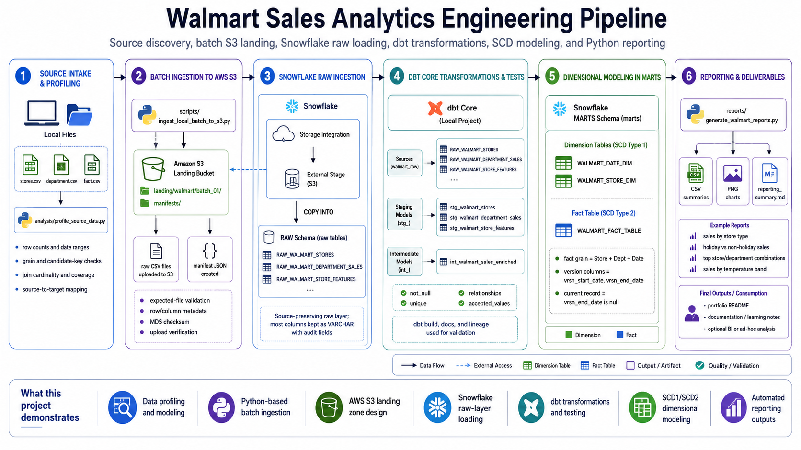

# Architecture Overview

The architecture diagram summarizes the Walmart Sales Analytics Engineering pipeline from source intake through reporting outputs.



## How to read the diagram

The pipeline moves left to right:

```text
Source intake and profiling
    -> Batch ingestion to Amazon S3
    -> Snowflake raw ingestion
    -> dbt Core transformations and tests
    -> Dimensional modeling in Snowflake marts
    -> Python reporting deliverables
```

## Key interpretation

dbt Core is the transformation framework, but Snowflake is where the SQL runs and where the transformed tables and views are materialized.

A concise way to explain this is:

> The models are defined in dbt Core and materialized in Snowflake.

## Main architecture responsibilities

| Layer | Responsibility |
|---|---|
| Source intake | Organize and profile the source CSVs |
| Python ingestion | Validate files, create a manifest, and upload the batch to S3 |
| Amazon S3 | Store the landed source files and manifest |
| Snowflake raw layer | Load source files into source-preserving raw tables |
| dbt Core | Define sources, models, tests, snapshots, docs, and lineage |
| Snowflake staging/marts | Store dbt-created views, tables, and snapshot results |
| Python reporting | Query final marts and generate CSV/PNG outputs |

## Diagram file

```text
screenshots/full-walkthrough/00-architecture-overview.png
```
