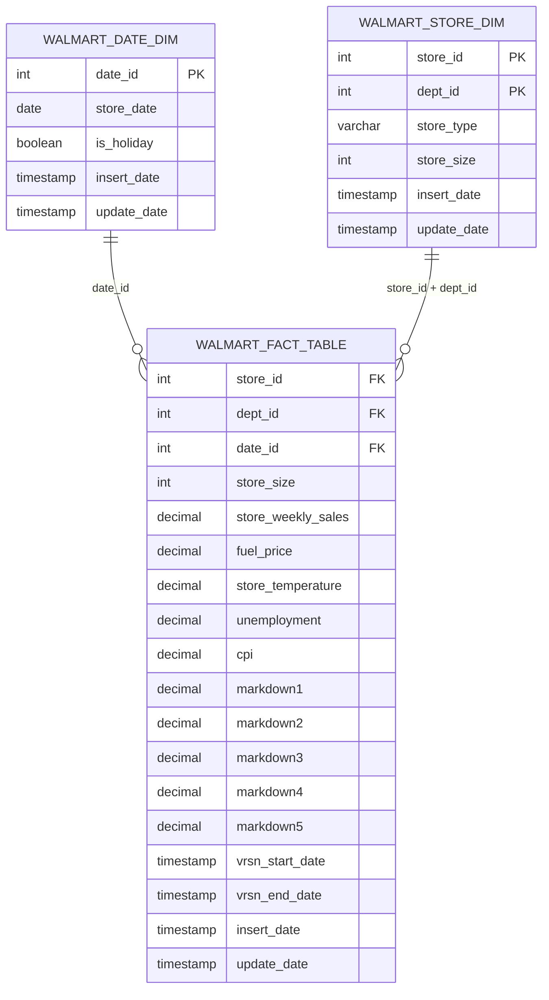

# Walmart Dimensional Model Design

## Business Objective

The project analyzes Walmart weekly sales across stores, departments, dates, holidays, store characteristics, markdown activity, and economic factors.

The modeled warehouse supports questions such as:

- Which stores and departments generate the highest weekly sales?
- How do holiday weeks compare with non-holiday weeks?
- How do sales vary by store type and store size?
- How do markdowns relate to weekly sales?
- How do temperature, fuel price, CPI, and unemployment relate to sales?
- How do sales change across years, months, and weekly dates?

## Architecture

```text
Local CSV files
        ↓
Amazon S3 landing area
        ↓
Snowflake raw tables
        ↓
dbt staging models
        ↓
dbt dimensional models
        ↓
Python reporting
```

## Dimensional Model



## Fact Table Grain

The grain of `walmart_fact_table` is:

```text
One version of one weekly sales record
for one store, one department, and one date.
```

The composite business key is:

```text
store_id + dept_id + date_id
```

Example:

```text
Store: 1
Department: 1
Date: 2010-02-05
Date ID: 20100205
Weekly sales: 24924.50
```

The three foreign keys together identify the same logical weekly-sales record across versions.

## Fact Record Versioning

The project requires SCD Type 2-style versioning on the fact table.

For the same composite business key:

```text
store_id + dept_id + date_id
```

if a tracked fact value changes:

1. The existing current record receives a `vrsn_end_date`.
2. The old version remains in the table.
3. A new version is inserted with a new `vrsn_start_date`.
4. The new current version has a null `vrsn_end_date`.

Example:

```text
Store 1 + Dept 1 + Date 20100205

Version 1
Weekly sales: 24924.50
Version start: 2026-06-15 08:00:00
Version end:   2026-06-16 09:00:00

Version 2
Weekly sales: 26000.00
Version start: 2026-06-16 09:00:00
Version end:   NULL
```

The composite business key identifies the logical record.

The version dates distinguish the historical physical rows.

The effective row-level uniqueness is:

```text
store_id + dept_id + date_id + vrsn_start_date
```

The supplied project guide does not require a separate surrogate primary-key column on the final fact table, so the final public model follows the guide as written.

## Dimension Grains

### Walmart Date Dimension

```text
One row per date
```

Primary key:

```text
date_id
```

### Walmart Store Dimension

```text
One row per store and department combination
```

Composite primary key:

```text
store_id + dept_id
```

Although the supplied name is `walmart_store_dim`, this table behaves like a combined store-department dimension because it contains both store and department identifiers.

A more normalized production model might separate these into:

```text
dim_store
dim_department
```

The combined design is retained because it matches the supplied project specification.

## Date Dimension Columns

| Column        | Purpose                                            |
| ------------- | -------------------------------------------------- |
| `date_id`     | Deterministic integer key in `YYYYMMDD` format     |
| `store_date`  | Original calendar date                             |
| `is_holiday`  | Identifies holiday weeks                           |
| `insert_date` | Timestamp when the row was first inserted          |
| `update_date` | Timestamp when the row was most recently processed |

Example:

```text
2010-02-05 → 20100205
```

## Store Dimension Columns

| Column        | Purpose                                            |
| ------------- | -------------------------------------------------- |
| `store_id`    | Source store identifier                            |
| `dept_id`     | Source department identifier                       |
| `store_type`  | Store classification from `stores.csv`             |
| `store_size`  | Store size from `stores.csv`                       |
| `insert_date` | Timestamp when the row was first inserted          |
| `update_date` | Timestamp when the row was most recently processed |

## Fact Table Columns

| Column                  | Purpose                                                          |
| ----------------------- | ---------------------------------------------------------------- |
| `store_id`              | Foreign key component referencing the store dimension            |
| `dept_id`               | Foreign key component referencing the store dimension            |
| `date_id`               | Foreign key referencing the date dimension                       |
| `store_size`            | Store size retained to match the supplied fact-table requirement |
| `store_weekly_sales`    | Weekly department sales measure                                  |
| `fuel_price`            | Fuel price for the store and date                                |
| `store_temperature`     | Temperature for the store and date                               |
| `unemployment`          | Unemployment measure for the store and date                      |
| `cpi`                   | Consumer Price Index measure                                     |
| `markdown1`–`markdown5` | Promotional markdown measures                                    |
| `vrsn_start_date`       | Timestamp when the fact version became valid                     |
| `vrsn_end_date`         | Timestamp when the version ended; null means current             |
| `insert_date`           | Timestamp when the version was inserted                          |
| `update_date`           | Timestamp when the version was most recently processed           |

## SCD Type 1 Dimensions

Both dimensions use SCD Type 1 behavior.

SCD Type 1 means:

```text
Existing business key found → overwrite current attributes
New business key found      → insert row
Historical values           → not retained
```

### Date Dimension Business Key

```text
date_id
```

### Store Dimension Business Key

```text
store_id + dept_id
```

## SCD Type 2 Fact Requirement

For the same:

```text
store_id + dept_id + date_id
```

dbt will compare the tracked measures.

If a tracked value changes, the existing version is closed and a new version is inserted.

Planned tracked values include:

* `store_size`
* `store_weekly_sales`
* `fuel_price`
* `store_temperature`
* `unemployment`
* `cpi`
* `markdown1`
* `markdown2`
* `markdown3`
* `markdown4`
* `markdown5`

## dbt Implementation Plan

```text
Snowflake raw source tables
        ↓
stg_walmart_stores
stg_walmart_department_sales
stg_walmart_store_features
        ↓
int_walmart_sales_enriched
        ↓
walmart_date_dim
walmart_store_dim
walmart_fact_snapshot
        ↓
walmart_fact_table
```

### Internal Snapshot Key

A dbt snapshot needs one value that identifies the same incoming business record across runs.

The intermediate model may therefore generate an internal helper key from:

```text
store_id + dept_id + date_id
```

This helper is used only for dbt snapshot processing.

It is not required as a visible column in the final `walmart_fact_table`.

### Snapshot Metadata Mapping

dbt snapshot metadata can be mapped to the required fact-table fields:

```text
dbt_valid_from → vrsn_start_date
dbt_valid_to   → vrsn_end_date
```

The final model exposes the columns required by the supplied project guide.

## Design Tradeoff: SCD2 on a Fact Table

SCD Type 2 is more commonly applied to dimensions.

Fact tables are often:

* append-only transaction tables;
* periodic snapshots;
* accumulating snapshots;
* rebuilt from source events.

This project explicitly requires SCD2-style history on the fact table.

The implementation therefore versions fact records at the:

```text
Store + Department + Date
```

grain.

A professional explanation is:

> The supplied requirement applies SCD2-style versioning to the Walmart fact table. I used Store ID, Department ID, and Date ID as the composite business key. If a tracked measure changed for that combination, the old record was end-dated and a new current version was inserted.

## Design Tradeoff: Store Size in the Fact Table

`store_size` is a descriptive store attribute and naturally belongs in the store dimension.

The supplied guide also lists it in the fact table.

The project therefore retains `store_size` in both places to match the target specification.

In a stricter production star schema, this duplication would normally be avoided unless justified by snapshot-history or performance requirements.

## Join Design

### Department Sales to Store Features

```text
department sales
LEFT JOIN store/date features
    ON store_id + store_date
```

Expected relationship:

```text
many department sales rows
to one store/date feature row
```

### Department Keys to Store Attributes

```text
distinct store_id + dept_id
LEFT JOIN store attributes
    ON store_id
```

Expected relationship:

```text
many store/department combinations
to one store row
```

## Data Quality Rules

### Raw Sources

Validate that:

* expected columns exist;
* files contain records;
* dates can be parsed;
* candidate keys match the expected grains.

### Staging Models

Validate that:

* `store_id` is not null;
* `dept_id` is not null where required;
* `store_date` is not null;
* numeric values cast successfully;
* source row counts remain explainable.

### Date Dimension

Validate that:

* `date_id` is unique;
* `date_id` is not null;
* `store_date` is unique;
* `is_holiday` has one consistent value per date.

### Store Dimension

Validate that:

* `store_id + dept_id` is unique;
* store type is populated;
* store size is populated;
* each department-sales key maps to a store record.

### Fact Table

Validate that:

* every fact row references a valid date;
* every fact row references a valid store/department combination;
* no business key has more than one current version;
* current records have a null `vrsn_end_date`;
* historical records have a populated `vrsn_end_date`;
* joins preserve the expected weekly-sales record count;
* version start and end timestamps are logically ordered.

## Reporting Layer

Python will connect to Snowflake and query the final modeled tables.

Planned report topics include:

* weekly sales by store and holiday;
* weekly sales by temperature and year;
* weekly sales by store size;
* weekly sales by store type and month;
* markdown totals by year;
* weekly sales by store type;
* fuel price by year;
* weekly sales by year, month, and date;
* weekly sales by CPI;
* department-level weekly sales.
