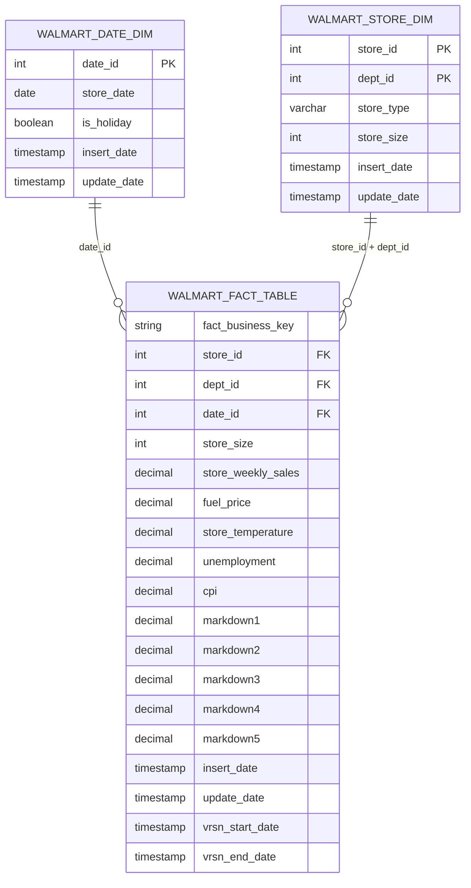

# Walmart Dimensional Model Design

## Business Objective

The project analyzes Walmart weekly sales across stores, departments, dates, holidays, store characteristics, markdown activity, and economic factors.

The modeled warehouse supports questions such as:

- Which stores and departments generate the highest weekly sales?
- How do holiday weeks compare with non-holiday weeks?
- How do sales vary by store type and store size?
- How do markdowns relate to weekly sales?
- How do temperature, fuel price, CPI, and unemployment relate to sales?
- How do sales change across years, months, and weeks?

## Architecture

```text
Local CSV files
        ↓
Amazon S3 landing area
        ↓
Snowflake raw tables
        ↓
dbt staging models
        ↓
dbt dimensional models
        ↓
Python reporting
```

## Dimensional Model



## Fact Table Grain

The grain is:

```text
One version of one weekly sales record
for one store, one department, and one date.
```

The business key is:

```text
Store_id + Dept_id + Date_id
```

Example:

```text
Store 1
Department 1
Date 2010-02-05
Date_id 20100205
Weekly_Sales 24924.50
```

## Dimension Grains

### Date Dimension

```text
One row per date
```

### Store Dimension

```text
One row per store and department combination
```

Although the supplied name is `walmart_store_dim`, the table behaves more like a combined store-department dimension.

A more normalized production model might separate this into:

```text
dim_store
dim_department
```

The combined model is retained to follow the supplied project specification.

## SCD Type 1 Dimensions

Both dimensions use SCD Type 1 behavior.

SCD Type 1 means:

```text
Existing business key found → overwrite attributes
New business key found      → insert row
Historical values           → not retained
```

### Date Dimension Key

```text
date_id
```

### Store Dimension Key

```text
store_id + dept_id
```

## SCD Type 2 Fact Requirement

The project specification requires SCD2-style versioning on the fact table.

For the same:

```text
store_id + dept_id + date_id
```

if one or more tracked measures changes, dbt will:

1. end-date the existing version;
2. retain the previous version;
3. insert a new current version.

Current record:

```text
vrsn_end_date IS NULL
```

Historical record:

```text
vrsn_end_date IS NOT NULL
```

## Tracked Fact Attributes

The planned SCD2 comparison includes:

- `store_size`
- `store_weekly_sales`
- `fuel_price`
- `store_temperature`
- `unemployment`
- `cpi`
- `markdown1`
- `markdown2`
- `markdown3`
- `markdown4`
- `markdown5`

## dbt Implementation Plan

```text
raw source tables
        ↓
stg_walmart_stores
stg_walmart_department_sales
stg_walmart_store_features
        ↓
int_walmart_sales_enriched
        ↓
walmart_date_dim            incremental SCD1
walmart_store_dim           incremental SCD1
walmart_fact_snapshot       dbt snapshot
        ↓
walmart_fact_table          final snapshot presentation model
```

## Why Use a dbt Snapshot for the Fact Versioning?

A dbt snapshot is designed to retain historical versions of changing records.

It can track:

- the business key;
- when a version became valid;
- when a version stopped being valid;
- which version is current.

The snapshot metadata can be renamed into the project-required columns:

```text
dbt_valid_from → vrsn_start_date
dbt_valid_to   → vrsn_end_date
```

## Design Tradeoff: SCD2 on a Fact Table

SCD Type 2 is more commonly applied to dimensions.

Fact tables are often:

- append-only transaction tables;
- periodic snapshots;
- accumulating snapshots;
- rebuilt from source events.

This project applies SCD2-style versioning to a fact table as an explicit requirement.

The implementation will therefore be described as:

> Versioned fact records at the Store + Department + Date grain.

That follows the project requirement while acknowledging the more common dimensional-modeling convention.

## Design Tradeoff: Store Size in the Fact Table

Store size is a descriptive store attribute and naturally belongs in the store dimension.

The supplied requirements are inconsistent:

- one target diagram places store size only in the dimension;
- another target definition also lists store size in the fact table.

The implementation retains `store_size` in the fact model to satisfy the broader supplied target definition, while also storing it in `walmart_store_dim`.

In a stricter production model, this duplication would normally be avoided unless justified for performance or snapshot-history requirements.

## Data Quality Rules

The model should validate:

### Raw sources

- expected columns exist;
- dates can be parsed;
- source files contain rows.

### Staging models

- `store_id` is not null;
- `dept_id` is not null where expected;
- `store_date` is not null;
- numeric fields cast successfully.

### Date dimension

- `date_id` is unique;
- `date_id` is not null;
- `store_date` is unique;
- `is_holiday` has one value per date.

### Store dimension

- `store_id + dept_id` is unique;
- store type and size are populated;
- every department-sales key maps to a store.

### Fact model

- `store_id + dept_id + date_id` identifies one current business record;
- every fact row joins to the date dimension;
- every fact row joins to the store dimension;
- current records have null `vrsn_end_date`;
- no business key has more than one current version;
- joins preserve the expected weekly-sales row count.

## Reporting Layer

Python will connect to Snowflake and query the final models.

Planned report topics include:

- weekly sales by store and holiday;
- weekly sales by temperature and year;
- weekly sales by store size;
- weekly sales by store type and month;
- markdown totals by year;
- weekly sales by store type;
- fuel price by year;
- weekly sales by year, month, and date;
- weekly sales by CPI;
- department-level weekly sales.

The reports may use `COALESCE` for markdown calculations while preserving nulls in the warehouse tables.
