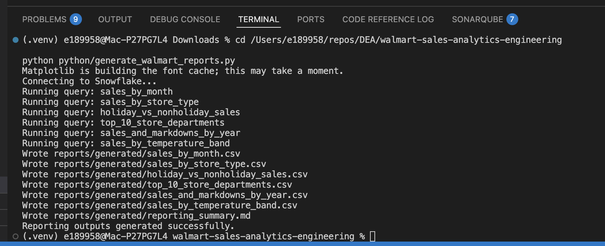
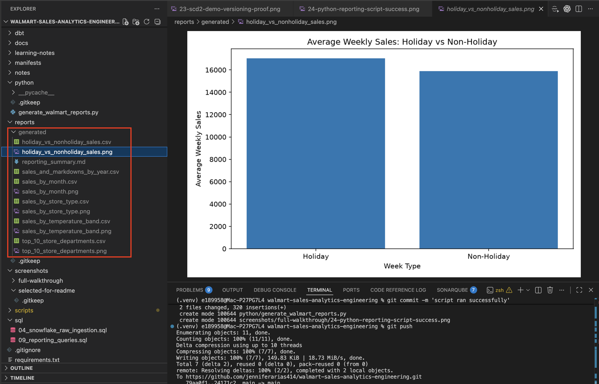
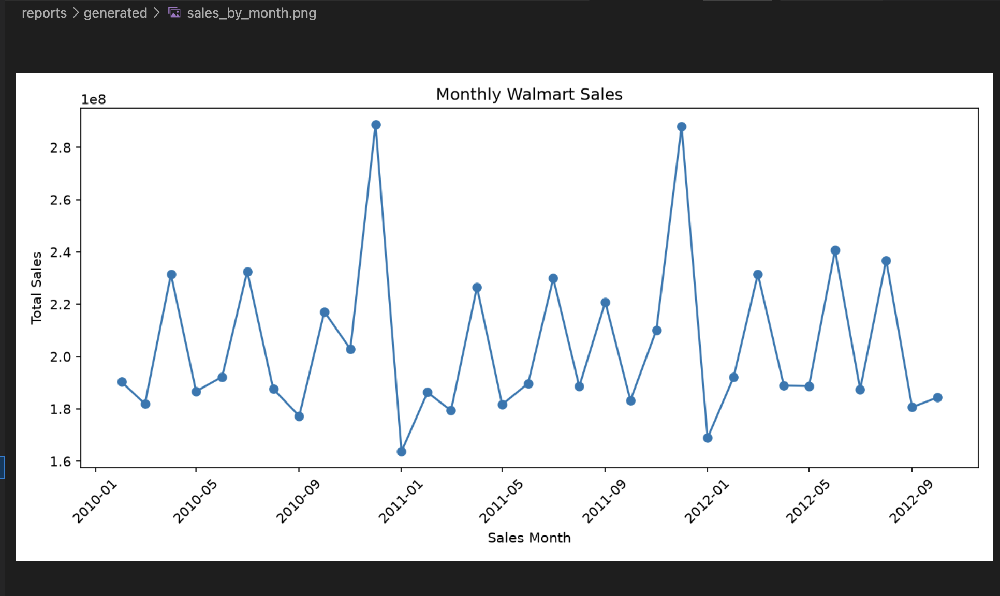

# Reporting Outputs

This project includes a Python reporting script that queries the final Snowflake mart tables and generates CSV and PNG outputs.

## Script

```text
scripts/generate_walmart_reports.py
```

## SQL

```text
sql/09_reporting_queries.sql
```

## Final mart tables used

```text
WALMART_FACT_TABLE
WALMART_DATE_DIM
WALMART_STORE_DIM
```

## Reports

| Report | Business Question |
|---|---|
| Monthly sales trend | How did total sales trend over time? |
| Sales by store type | Which store type contributed the most sales? |
| Holiday versus non-holiday sales | How do holiday and non-holiday weeks compare? |
| Top 10 store/department combinations | Which store/department combinations had the highest sales? |
| Sales and markdowns by year | How do sales and markdown activity compare by year? |
| Sales by temperature band | How does average sales vary by temperature range? |

## Output location

```text
reports/generated/
```

## Environment variables

Required:

```text
SNOWFLAKE_ACCOUNT
SNOWFLAKE_USER
SNOWFLAKE_PASSWORD
```

Optional:

```text
SNOWFLAKE_ROLE
SNOWFLAKE_WAREHOUSE
SNOWFLAKE_DATABASE
SNOWFLAKE_SCHEMA
```

Environment variables are used so credentials are not stored in the repo.

## Evidence

The reporting script completed successfully.



The report outputs were generated under `reports/generated/`.



Sample report chart:


