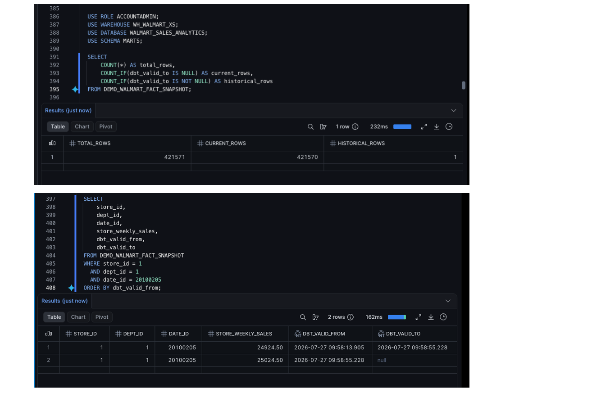

# SCD2 Demo Proof

This project uses a dbt snapshot to implement the required SCD2-style fact table.

Because only one source batch is used in the official pipeline, the official fact table has only current rows:

```text
total rows       421,570
current rows     421,570
historical rows  0
```

That is expected for a first snapshot run.

To demonstrate how SCD2 versioning behaves after a changed second batch, this project includes an optional demo snapshot:

```text
demo_walmart_fact_snapshot
```

## What the demo changes

The demo simulates a changed value for one existing business key:

```text
store_id = 1
dept_id  = 1
date_id  = 20100205
```

The changed tracked field is:

```text
store_weekly_sales
```

## Commands

Baseline run:

```bash
dbt snapshot --select demo_walmart_fact_snapshot
```

Simulated changed-batch run:

```bash
dbt snapshot --select demo_walmart_fact_snapshot --vars '{"demo_adjust_weekly_sales": true}'
```

## Validation query

```sql
USE ROLE ACCOUNTADMIN;
USE WAREHOUSE WH_WALMART_XS;
USE DATABASE WALMART_SALES_ANALYTICS;
USE SCHEMA MARTS;

SELECT
    COUNT(*) AS total_rows,
    COUNT_IF(dbt_valid_to IS NULL) AS current_rows,
    COUNT_IF(dbt_valid_to IS NOT NULL) AS historical_rows
FROM DEMO_WALMART_FACT_SNAPSHOT;
```

Expected:

```text
total_rows       421,571
current_rows     421,570
historical_rows  1
```

Inspect the changed key:

```sql
SELECT
    store_id,
    dept_id,
    date_id,
    store_weekly_sales,
    dbt_valid_from,
    dbt_valid_to
FROM DEMO_WALMART_FACT_SNAPSHOT
WHERE store_id = 1
  AND dept_id = 1
  AND date_id = 20100205
ORDER BY dbt_valid_from;
```

Expected pattern:

```text
Old version:
dbt_valid_to is populated.

New version:
dbt_valid_to is null.
```

## Evidence



## Interpretation

The demo proves that the snapshot logic can preserve history when the same business key arrives with a changed tracked value.

The official fact table remains clean and unchanged by this demo.
