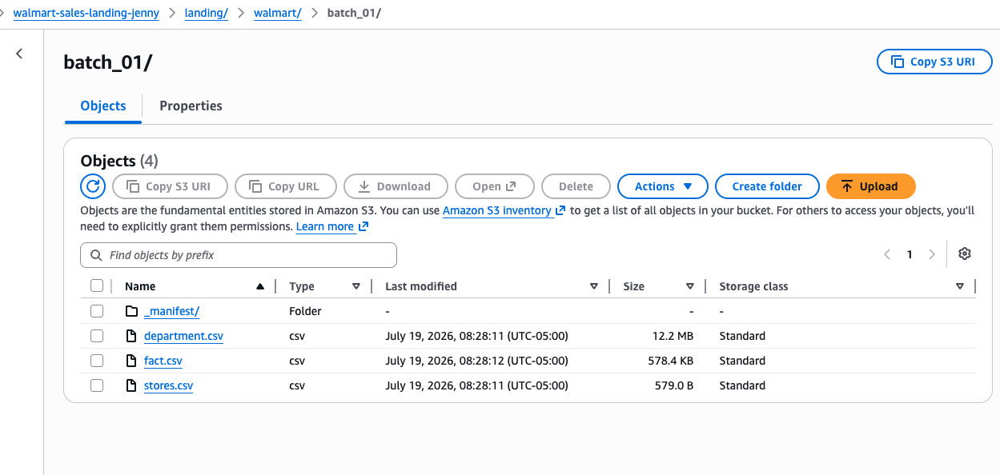

# Batch Ingestion to S3

## Purpose

After profiling and modeling the source data, I built a Python utility to ingest the supplied Walmart CSV files from my local project folder to an S3 landing bucket.

The goal was to make the file load reproducible and auditable instead of manually uploading each file.

## Ingestion flow

```text
Local project CSV files
    ↓
Python batch-ingestion utility
    ↓
File validation
    ↓
Checksum and metadata collection
    ↓
S3 upload
    ↓
S3 object verification
    ↓
JSON manifest
```

## Why not manual upload?

Manual upload through the AWS console would work for a small demo, but it is harder to reproduce, is more work, and does not automatically record validation metadata.

The Python utility was a better fit because it:

- validates the expected files;
- checks expected columns;
- records row counts;
- calculates file checksums;
- uploads the files as one batch;
- verifies the uploaded S3 objects;
- writes a JSON manifest.

## Project-specific design

This script is intentionally specific to the Walmart project.

It expects exactly:

```text
stores.csv
department.csv
fact.csv
```

and checks each file against the expected columns.

For this project, strict validation is useful because the goal is to ingest the correct source delivery, not accept any random CSV file.

## Manifest

The manifest acts like a receipt for the ingestion run.

It records:

- batch label;
- ingestion timestamp;
- destination bucket and prefix;
- filenames;
- row counts;
- columns;
- file sizes;
- checksums;
- S3 object keys and URIs;
- verification status.

## Scope decision

This project uses an operator-triggered Python utility because the source files were delivered locally as a controlled batch.

In a larger enterprise environment, the upstream producer might be an orchestrated workflow, database replication process, application export, scheduled server job, or managed file-transfer service.

The Python utility simulates the upstream producer role for this project without overengineering the build.

## Completed evidence

The successful S3 batch ingestion is shown in the screenshot below, including the completed uploads and manifest creation.

