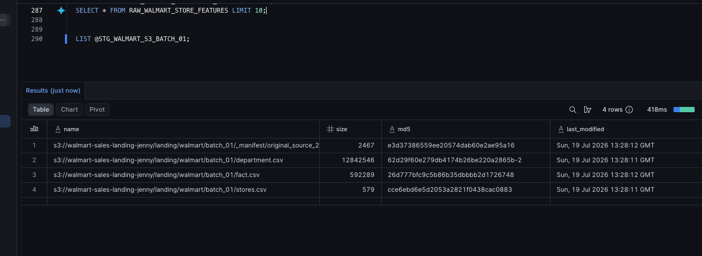
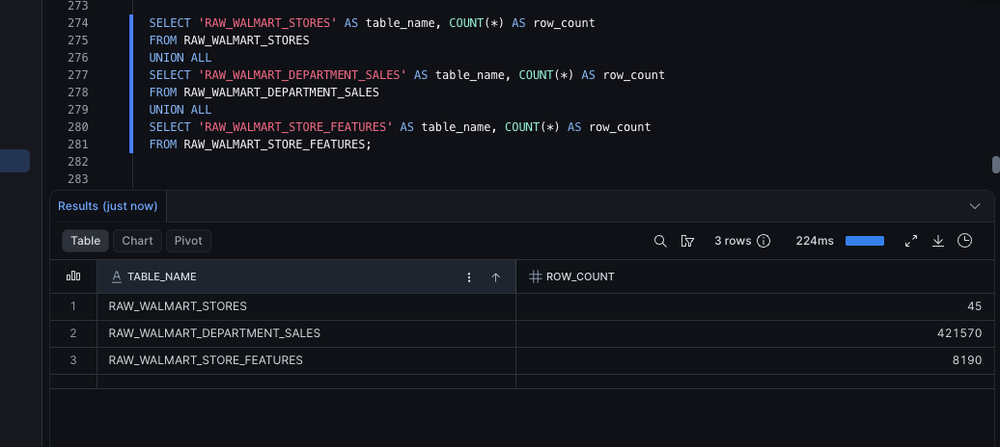

# Snowflake Raw Ingestion

## Purpose

After landing the Walmart source batch in S3, I loaded the files into Snowflake raw tables.

This phase creates the raw Snowflake layer only. The final dimensions, fact table, SCD logic, and reporting are built later with dbt and Python.

## Flow

```text
Local CSV files
    ↓
Python batch ingestion utility
    ↓
S3 landing bucket
    ↓
Snowflake external stage
    ↓
COPY INTO
    ↓
Snowflake raw tables
```

## Snowflake objects created

This phase created:

```text
warehouse
database
RAW schema
STAGING schema
MARTS schema
CSV file format
storage integration
external stage
raw source tables
```

The raw tables are:

```text
RAW_WALMART_STORES
RAW_WALMART_DEPARTMENT_SALES
RAW_WALMART_STORE_FEATURES
```

## Why use a raw layer?

The raw layer preserves the source delivery before business transformations are applied.

Because the source files are CSVs, the raw tables keep values mostly as `VARCHAR`. This avoids forcing final data types too early.

The intentional type casting happens later in dbt staging models.

For example:

```sql
TRY_TO_NUMBER(store_raw) AS store_id
TRY_TO_DATE(date_raw) AS store_date
TRY_TO_DECIMAL(weekly_sales_raw, 18, 2) AS store_weekly_sales
TRY_TO_BOOLEAN(is_holiday_raw) AS is_holiday
```

## Storage integration and stage

Snowflake needed a secure way to read the private S3 landing prefix.

I used:

```text
Snowflake storage integration
AWS IAM role
Snowflake external stage
```

The storage integration and AWS IAM role handle access. The external stage points Snowflake to the S3 folder containing the batch files.

## File format

The CSV file format tells Snowflake how to parse the source files.

Important settings:

```text
skip the header row
use comma delimiter
handle quoted values
load blank fields as NULL
trim extra spaces
```

## Loading with COPY INTO

I used `COPY INTO` to load each staged CSV into its corresponding raw table.

The raw tables also include metadata columns:

```text
source_file_name
loaded_at
```

These fields help identify where each row came from and when it was loaded.

## Validation

I validated the raw load by comparing Snowflake row counts back to the earlier source profiling results.

Expected and observed counts:

| Table | Row Count |
|---|---:|
| `RAW_WALMART_STORES` | 45 |
| `RAW_WALMART_DEPARTMENT_SALES` | 421,570 |
| `RAW_WALMART_STORE_FEATURES` | 8,190 |

## Completed evidence

Snowflake was able to list the S3 files through the external stage:



The raw Snowflake row counts matched the source profiling results:



## Main takeaway

This phase moved the project from file storage into the warehouse.

The important distinction is:

```text
S3 stores the original CSV objects.
Snowflake raw stores table copies of those source files.
dbt staging will apply the intended warehouse schema.
```
