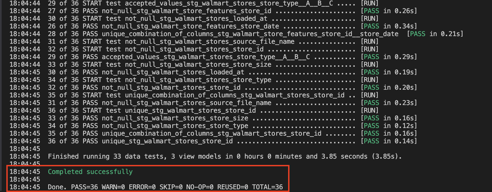
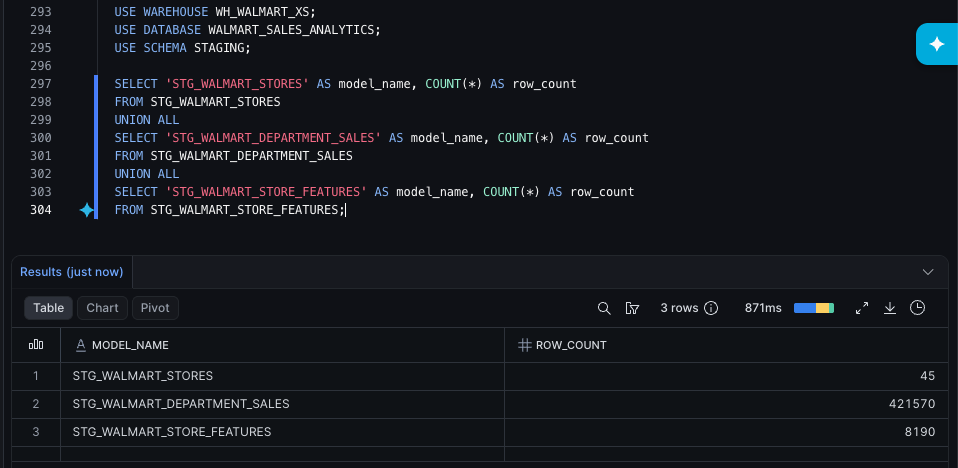
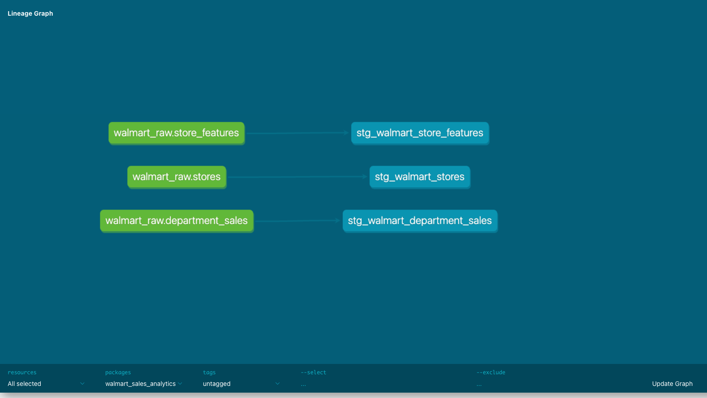

# dbt Staging Models

## Purpose

After connecting dbt to Snowflake, I created staging models for the three Walmart raw source tables.

This is the first phase where dbt transforms the data.

## Flow

```text
Snowflake RAW tables
    ↓
dbt staging models
    ↓
clean names and intentional data types
```

The staging models are:

```text
stg_walmart_stores
stg_walmart_department_sales
stg_walmart_store_features
```

## What staging does

The raw Snowflake tables were loaded from CSV files and kept mostly as `VARCHAR`.

The staging models convert those raw fields into cleaner warehouse fields.

Examples:

```sql
TRY_CAST(store_raw AS NUMBER(10, 0)) AS store_id
TRY_TO_DATE(date_raw) AS store_date
TRY_CAST(weekly_sales_raw AS NUMBER(18, 2)) AS store_weekly_sales
TRY_CAST(is_holiday_raw AS BOOLEAN) AS is_holiday
```

## Source-aligned design

Each staging model stays aligned to one raw source table.

| Raw Source | Staging Model | Grain |
|---|---|---|
| `RAW_WALMART_STORES` | `stg_walmart_stores` | One row per store |
| `RAW_WALMART_DEPARTMENT_SALES` | `stg_walmart_department_sales` | One row per store, department, and date |
| `RAW_WALMART_STORE_FEATURES` | `stg_walmart_store_features` | One row per store and date |

No joins happen in this phase. The goal is to clean each source individually before combining them.

## Tests added

The staging layer includes tests for:

```text
not-null fields
unique store IDs
accepted store types
unique candidate keys
```

The custom generic test:

```text
unique_combination_of_columns
```

checks composite keys such as:

```text
store_id + dept_id + store_date
store_id + store_date
```

This carries forward the same candidate-key checks from the earlier profiling phase into dbt.

## Build command

The staging models and tests were built with:

```bash
dbt build --select path:models/staging
```

## Completed evidence

The dbt staging build completed successfully:



The Snowflake staging row counts matched the source and raw counts:



The dbt docs lineage shows each raw source feeding its staging model:



## Why I added dbt tests

The staging models could run without tests, but tests make the project more reliable.

The tests are not there just to add complexity. They document and check assumptions discovered during profiling.

Earlier profiling showed the expected grain of each source:

```text
stores:
one row per store

department sales:
one row per store, department, and date

store features:
one row per store and date
```

In dbt, I turned those expectations into tests.

Examples:

```text
stg_walmart_stores:
store_id should be unique and not null

stg_walmart_department_sales:
store_id + dept_id + store_date should be unique together

stg_walmart_store_features:
store_id + store_date should be unique together
```

I also tested:

```text
store_type should only be A, B, or C
important key fields should not be null
```

## Custom generic test

I added a custom generic test called:

```text
unique_combination_of_columns
```

This checks whether multiple columns are unique together.

That was needed because some grains are composite keys.

For example:

```text
store_id + dept_id + store_date
```

is the expected unique key for department sales.

A normal single-column `unique` test would not prove that.

## What I did not test

I did not test every column as not-null.

Some nulls are expected and meaningful.

For example, markdown fields had many nulls in the source, so those nulls are preserved in staging instead of being forced to zero.

This keeps the staging layer honest to the source data.

## How I would explain this decision

> dbt tests were not mandatory for the models to run, but I added targeted tests because they make the project more trustworthy. I used the profiling results to decide what to test: key fields, candidate keys, accepted store types, and grain expectations. I did not test every column because some nulls are valid, especially the markdown fields.

## Main takeaway

The staging layer is where raw source-shaped data becomes clean, typed, and ready for modeling.

The important distinction is:

```text
RAW:
Preserve what arrived.

STAGING:
Clean names and enforce intended types.

INTERMEDIATE:
Join and prepare reusable business logic.

MARTS:
Final dimensions and facts.
```

Next, the project moves into an intermediate model that joins sales, store attributes, and store/date context.
