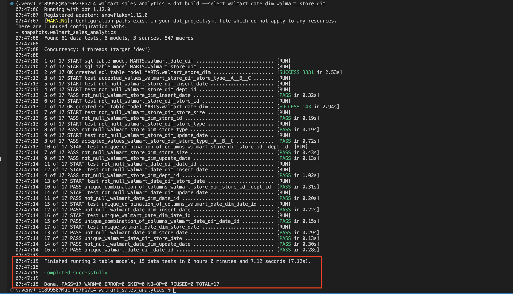
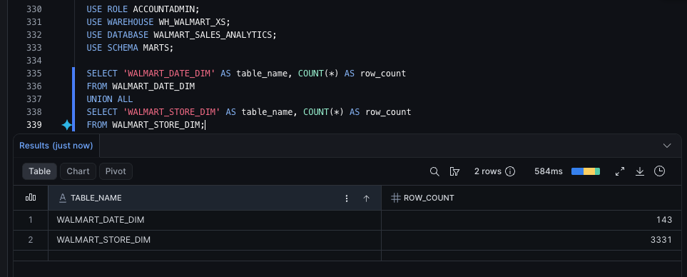
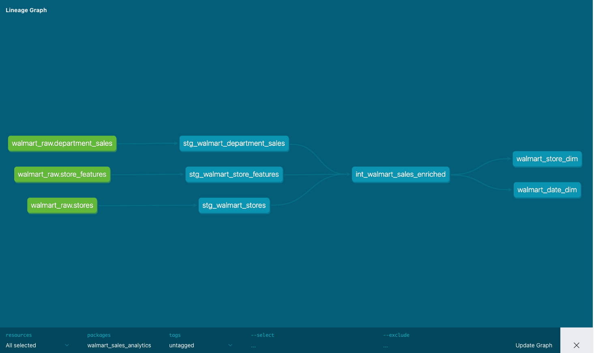

# SCD Type 1 Dimensions

## Purpose

After building the intermediate enriched sales model, I created the final SCD Type 1 dimension tables.

The dimensions are part of the mart layer and are intended for downstream reporting.

## Flow

```text
int_walmart_sales_enriched
    ↓
walmart_date_dim
walmart_store_dim
```

## What SCD Type 1 means

SCD Type 1 means old descriptive values are not preserved as separate history records.

Plain English:

```text
Keep the current value.
If something changes, overwrite the previous value.
```

For this project, the date and store dimensions are SCD Type 1.

## Date dimension

Model:

```text
walmart_date_dim
```

Grain:

```text
one row per sales date
```

Key:

```text
date_id
```

The date key is generated in `YYYYMMDD` format:

```text
2010-02-05 -> 20100205
```

This is deterministic, readable, and stable across rebuilds.

Expected row count:

```text
143
```

## Store dimension

Model:

```text
walmart_store_dim
```

Grain:

```text
one row per store and department
```

Composite key:

```text
store_id + dept_id
```

Expected row count:

```text
3,331
```

The dimension includes `dept_id` because the supplied project target design expects a store/department-style dimension.

## Tests and validation

The dimensions were tested for:

```text
not-null keys
unique date_id
unique store_date
unique store_id + dept_id combination
accepted store_type values
not-null insert/update timestamps
```

These tests confirm that the dimension tables match their expected grain.

## Completed evidence

The dbt dimension build completed successfully:



The Snowflake validation confirmed the expected row counts and uniqueness checks:



Optional dbt docs lineage screenshot:



## Main takeaway

The dimension models are final mart-layer tables.

The important distinction is:

```text
INTERMEDIATE:
Reusable joined data.

MART DIMENSIONS:
Business-facing descriptive tables.

SCD TYPE 1:
Current descriptive values only, no historical versions.
```

Next, the project builds the SCD2-style fact table.
