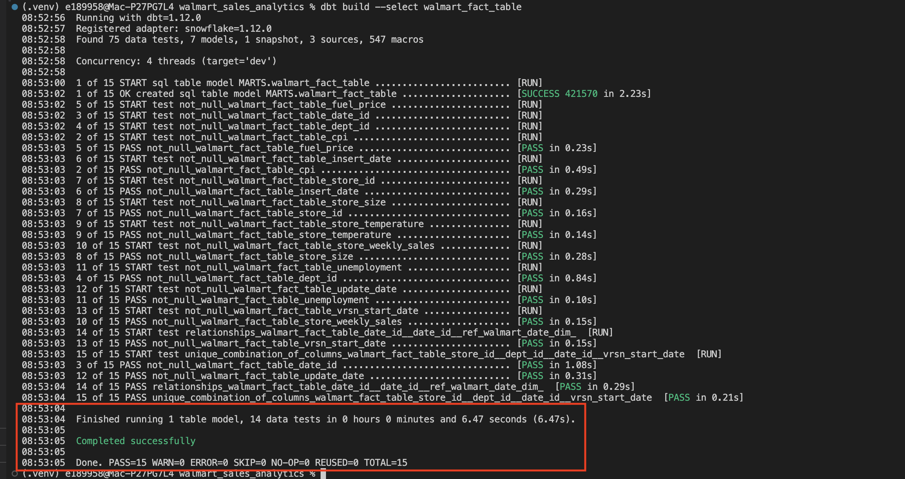
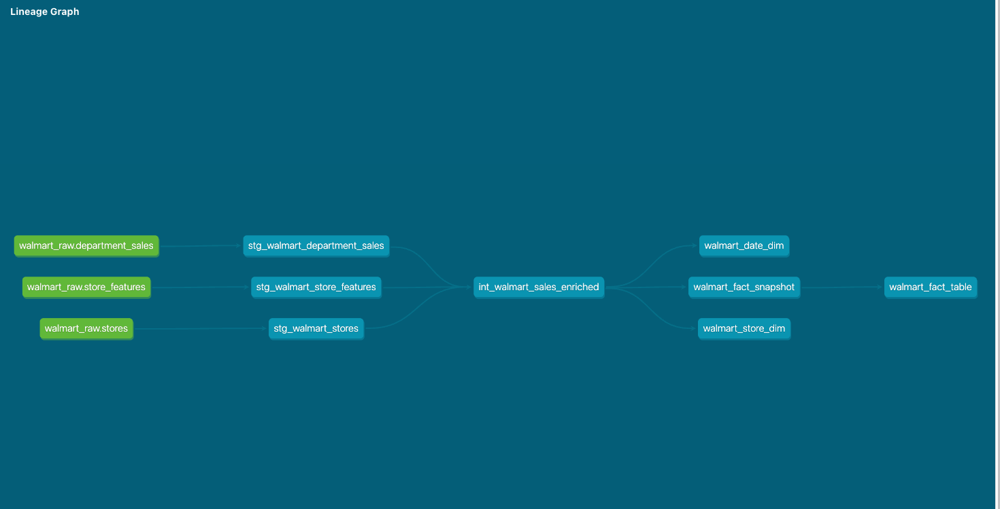

# SCD2-Style Fact Table

## Purpose

The project requires a final Walmart fact table with SCD2-style versioning.

To implement that, I used a dbt snapshot as the technical history layer and then created a final fact model from the snapshot.

## Flow

```text
int_walmart_sales_enriched
    ↓
walmart_fact_snapshot
    ↓
walmart_fact_table
```

## Business key

The logical business key is:

```text
store_id + dept_id + date_id
```

This represents one weekly department sales record for one store and one date.

Because dbt snapshots require one unique key value, I created a helper key in the snapshot:

```text
fact_business_key
```

The final fact table does not expose this helper key.

## Check strategy

The snapshot uses dbt's check strategy.

This strategy compares selected columns for the same business key across snapshot runs.

Tracked columns include:

```text
store_weekly_sales
fuel_price
store_temperature
unemployment
cpi
markdown1-5
store_size
```

If one of those tracked values changes for the same `store_id + dept_id + date_id`, dbt end-dates the previous version and inserts a new current version.

## Version columns

The dbt snapshot creates validity metadata:

```text
dbt_valid_from
dbt_valid_to
```

The final fact table renames those to match the project target design:

```text
vrsn_start_date
vrsn_end_date
```

Current records have:

```text
vrsn_end_date = null
```

Historical records have:

```text
vrsn_end_date populated
```

## First-run result

Because this project has one observed source batch, the first snapshot run produces only current records:

```text
total fact rows       421,570
current fact rows     421,570
historical fact rows  0
```

This is expected.

SCD2 history appears after a later batch changes a tracked value for an existing business key.

## Validation

The fact table was validated with:

```text
snapshot and fact row counts
current versus historical row counts
current business-key uniqueness
dimension relationship coverage
```

The validation SQL is collected in:

```text
docs/validation-queries.md
```

## Completed evidence

The dbt snapshot completed successfully:



The dbt fact build completed successfully:


The Snowflake fact validation confirmed row counts, current/historical status, business-key uniqueness, and dimension matches:


Optional dbt docs lineage screenshot:



## Main takeaway

The fact table uses SCD2-style versioning so that changed business values can be tracked over time.

The important distinction is:

```text
Snapshot:
Technical table that detects and stores versions.

Final fact table:
Clean project-facing output with required column names.
```
